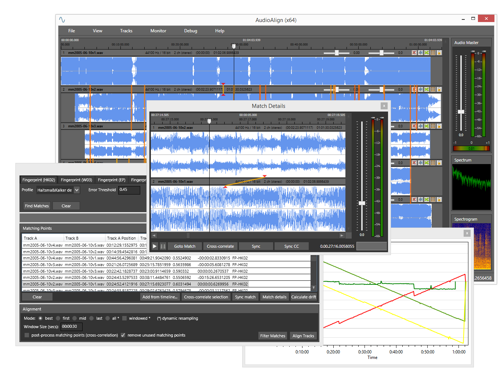

AudioAlign: Audio Synchronization And Analysis Tool
===================================================

AudioAlign is a tool written for research purposes to automatically synchronize audio and video recordings that have either been recorded in parallel at the same event or contain the same aural information.

AudioAlign is basically a GUI for the [Aurio](https://github.com/protyposis/Aurio) library with a little bit of glue code in between.

To see what AudioAlign can do, check the demo videos linked below.

Use cases
---------

AudioAlign has been developed for a research project with the goal to automatically synchronize audio and video recordings, recorded at the same time at the same event, e.g. a speech or a music concert. The idea was to synchronize all those videos taken from the crowd and combine them to

* generate multicamera cuts by switching between perspectives ([video](https://www.youtube.com/watch?v=QXQVPXjR3Lc)),
* create videos with full or at least better event coverage,
* replace bad quality audio or video tracks with better ones, or
* detect interesting moments (where many recordings have been captured at the same time).

AudioAlign can be used for a lot more uses cases though, including

* video mashups ([video](https://www.youtube.com/watch?v=cdv4-gOxxZ0))
* comparison of live performances ([video](https://www.youtube.com/watch?v=4yUSLa4K3GE))
* synchronization of different cover interpretations ([video](https://www.youtube.com/watch?v=Jo2XPXUmkK0))
* voice dubbing ([video](https://www.youtube.com/watch?v=f89isFfLgvg))
* ground truth creation ([website](http://protyposis.github.io/JikuMVD-SynchronizationGroundTruth/))
* evaluation of fingerprinting algorithms
* ...

What's new
----------

### 2018-03-21 beb56f1

* Update [Aurio](https://github.com/protyposis/Aurio#2018-03-21-a2e930d)
* Requires Visual Studio 2017 (due to Aurio update to .NET Standard 2.0 / .NET Core 2.0)

### 2017-10-15 d87bb4e

* Validate matches before executing aligment and show error message box if validation fails
* Show error message box if added file cannot be read
* Report progress during HK/CP match finding and filtering

### 2017-02-06 ec054a6

* Concatenated tracks consisting of multiple files (hold `SHIFT` key when adding)

### 2016-03-01 8539db8

* Support for compressed audio and video file formats
* Close file handles after use
* see the [Aurio changes](https://github.com/protyposis/Aurio#2016-03-01-fe49ea5) for details

Support
-------

For questions and issues, please open an issue on the issue tracker. Commercial support, development
and consultation is available through [Protyposis Multimedia Solutions](https://protyposis.com).

Building & Running
------------------

AudioAlign requires Visual Studio 2017 and the .NET Framework 4.6.2. It depends on Aurio, which is included as a Git submodule, and OxyPlot, which is automatically downloaded by Visual Studio through NuGet when compiling for the first time. Make sure that NuGet downloads are enabled by checking `Allow NuGet to download missing packages` in `Tools -> Options -> NuGet Package Manager`.

1. Clone the repository and Aurio submodule: `git clone --recursive https://github.com/protyposis/AudioAlign.git`
2. Setup FFmpeg dependencies, see `Aurio\libs\ffmpeg\ffmpeg-prepare.txt`
3. Open `AudioAlign.sln` in Visual Studio and hit the Start button

Documentation
-------------

Not available yet. If you have any questions, feel free to open an issue!

Controls & Shortcuts
--------------------

* Audio and video files can be drag & dropped into the timeline
  * Multiple files will be added as multiple tracks
  * Hold `SHIFT` to add the files as a single concatenated track
* Navigating the multitrack view
  * _Click anywhere_ or _drag the caret_ in the time scale to set the current (playback) position
  * Press `SPACE` to start/pause playback
  * Vertically _drag_ the bottom of a track to resize its height
  * _Scroll the mouse wheel_ to scale the time resolution (zoom into/out of the timeline) at the current position 
    * Hold `CTRL` to smoothly scroll the timeline
    * Hold `CTRL + SHIFT` to page through the timeline 
  * Select a track by _clicking_ its title bar
    * Hold `CTRL` to select multiple tracks
    * Hold `SHIFT` to select a range of tracks
  * Move tracks on the timeline by _dragging_ them horizontally

License
-------

Copyright (C) 2010-2018 Mario Guggenberger <mg@protyposis.net>.
This project is released under the terms of the GNU Affero General Public License. See `LICENSE` for details.
